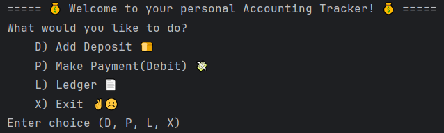
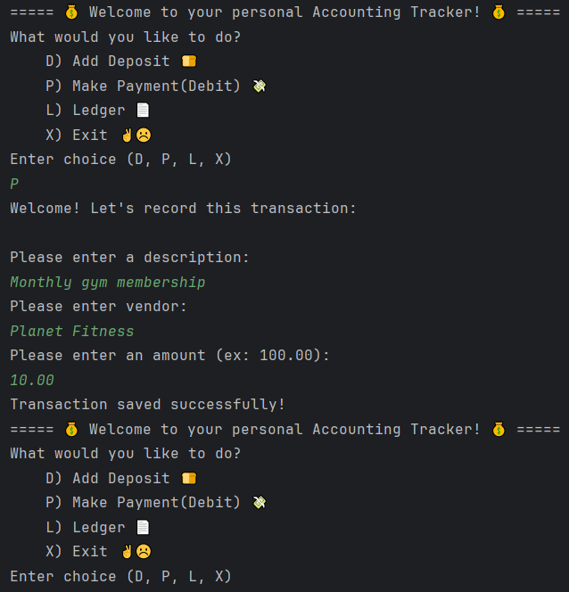
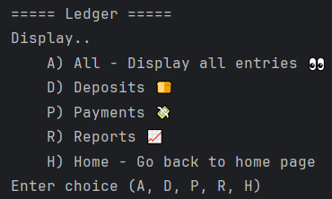
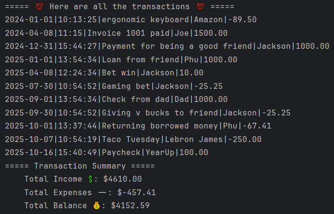
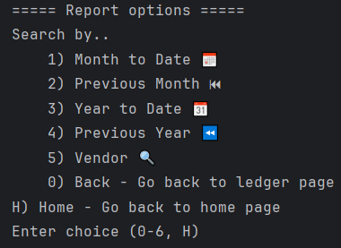
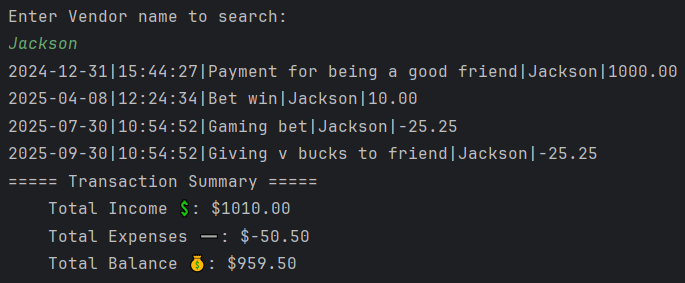
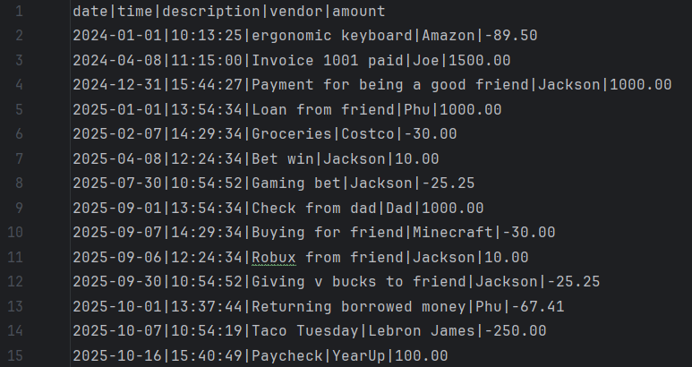

# 💰Accounting Ledger Application💰

A Java-based financial application that allows users to record, track, and view their deposits and payments while providing useful reports on finding certain transactions all located in the "transactions.csv" file.

---
## Welcome/Display Home Screen: Takes Deposits and Payment


Features:

- **Add Deposit (`D`)** — Prompts user for Deposit info and saves to file
- **Make Payment (`P`)** — Prompts user for Payment info and saves to file
- **Ledger Menu (`L`)** — Displays Ledger menu with more options for transactions
---

---
## Home Screen Example (Payment)

---

---
## Ledger Menu Screen: Tracks All Transactions, All Deposits, and All Payments


Features:
- **All (`A`)** - shows all transactions in the file including total income, expenses, and balance
- **Deposits (`D`)** - shows all deposits in the file
- **Payments (`P`)** - shows all payments in the file
- **Reports (`R`)** — Displays Reports menu with filters for transactions
---

---
## Ledger Display Example (All)

---

---
## Report Menu Screen: Filters Transactions with Date Searches and Vendor Search


Features:
- 1-5 include showing total income, expenses, and balance for that filter
- **Month to Date (`1`)** - shows all transactions from this month to today
- **Previous Month (`2`)** - shows all transactions from the previous month
- **Year to Date (`3`)** - shows all transactions from this year to today
- **Previous Year (`4`)** — shows all transactions from the previous year
- **Vendor (`5`)** - shows all transactions from inputted vendor name
- **Ledger (`0`)** - goes back to ledger screen
- **Home (`H`)** - goes back to home page
---

---
## Report Search Example (Vendor)

---

---
## CSV File:

---

---
## Interesting Piece of Code:
``` java
// Being able to search by dates including month/year to date and previous month/year
    public static List<Transaction> searchByDate(List<Transaction> transactions, LocalDate start, LocalDate end) {
        List<Transaction> filteredReports = new ArrayList<>();

        for(Transaction t : transactions) {
            if((t.getDate().isAfter(start) || t.getDate().isEqual(start)) && (t.getDate().isBefore(end) || t.getDate().isEqual(end))) {
                filteredReports.add(t); // Includes the first and last days of the month
            }
        }
        return filteredReports;
    }
```
This code shows how I handled showing month/year to date and previous month/year.

In my first attempt, it would not count the first and last days of a month because it was only (t.getDate().isAfter(start) && t.getDate().isBefore(end)) which only included dates between the start and end. But by adding t.getDate().isEqual(start) and t.getDate().isEqual(end), it includes the start and end date now. 

---


